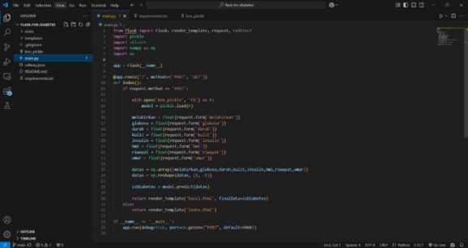
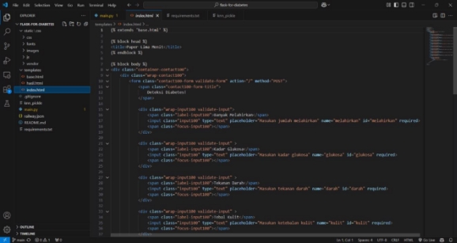
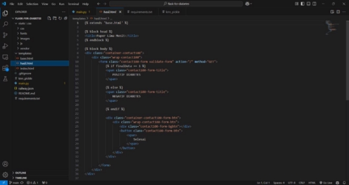
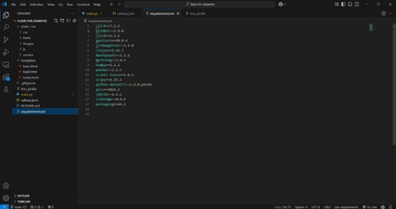
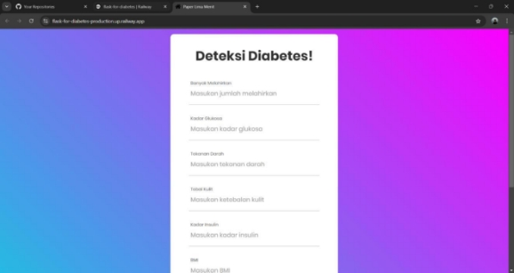
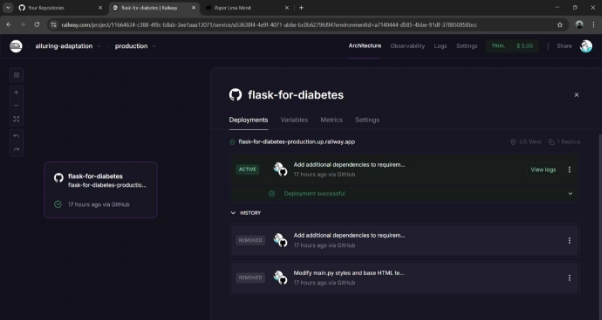
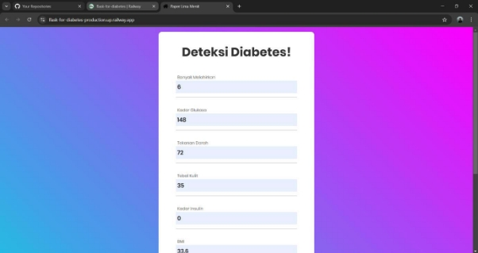
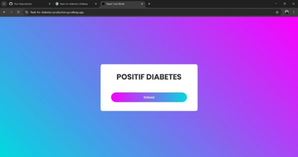
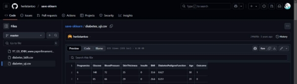

**TUGAS PERTEMUAN 15 MACHINE LEARNING**

Nama : Daffa Fauzan Dzaki Kelas  : TIF A1

NPM  : 41155050210014

1. Source code Main.py

2. Tampilan template yaitu index.html untuk input 

3. Tampilan source code untuk hasil yaitu hasil.html 

   

4. Tampilan source code requirements untuk python untuk instalasi dependensi 

   

5. Tampilan halaman deteksi diabetes 

6. Melakukan deployment deteksi diabetes melalui railways 

7. Melakukan pengetesan fungsi aplikasi yang sudah di deploy, dapat diakses[ disini,](https://flask-for-diabetes-production.up.railway.app/) namun jika mendapatkan error code 502, refresh karna aplikasi sedang mode sleep untuk efisiensi resource 

