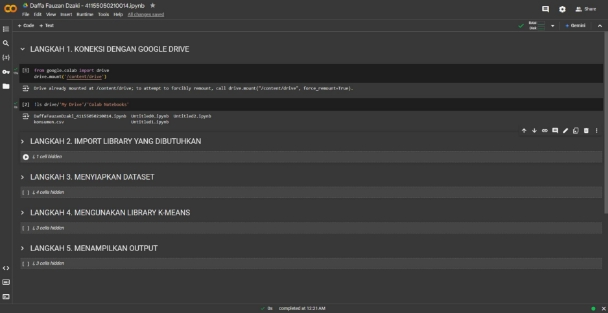
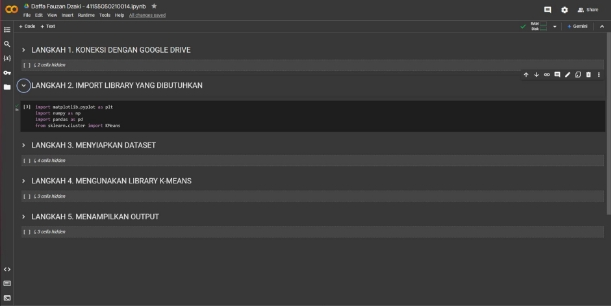
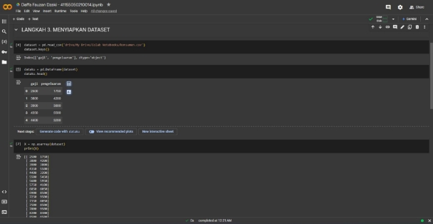
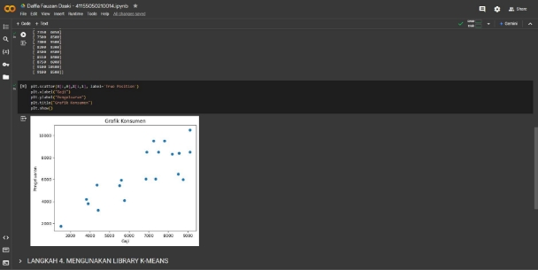
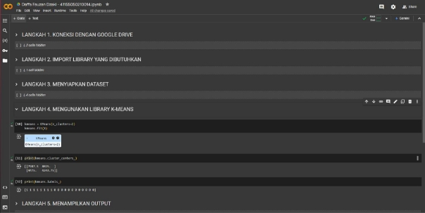
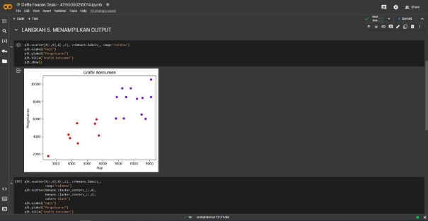
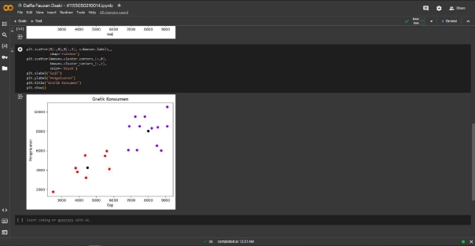

TUGAS PERTEMUAN 9 MACHINE LEARNING

Nama : Daffa Fauzan Dzaki

Kelas : TIF A1

NPM : 41155050210014

- Langkah 1. Koneksi dengan google drive

- Langkah 2. Import library yang dibutuhkan

- Langkah 3. Menyiapkan Dataset

- Langkah 4. Menggunakan library K-Means

- Langkah 5. Menampilkan Output

